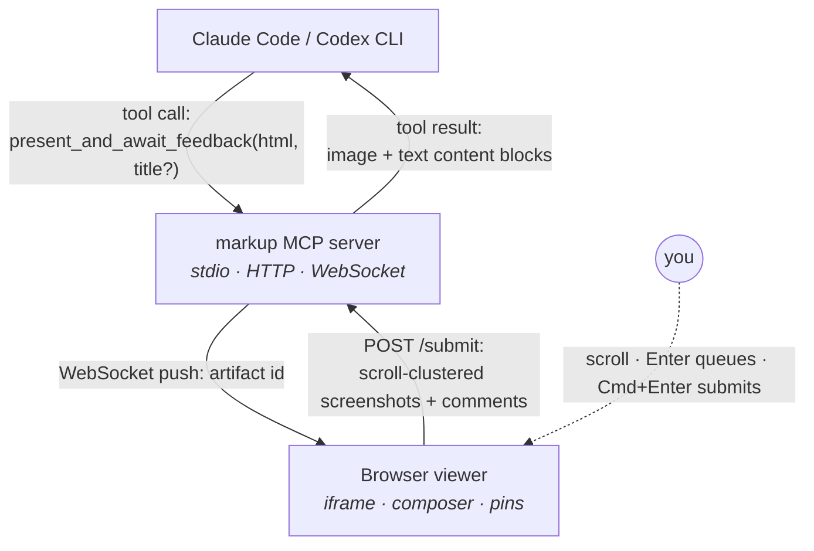

# markup

> A universal annotation overlay for any HTML a coding agent renders. One MCP tool call: the agent sends HTML, you scroll and comment in your browser, feedback returns automatically as image + text. No copy-paste.

Local-first MCP server + browser viewer. Distributed as a clone-and-run repo — no npm publish, no daemon, no central service. Works with Claude Code, OpenAI Codex, or any MCP-speaking agent.

## Why this exists

Agents are getting really good at generating rich HTML output — specs, plans,
dashboards, interactive tools. But there was always a gap: the agent renders
something, you look at it, you have thoughts — and then what? You copy text,
switch windows, paste it back, and manually describe what you saw. Every time.

**markup closes that loop.** It gives any HTML artifact a built-in annotation
layer. You scroll, you comment inline as you read, and when you're done — one
keypress packages everything: your words, the exact regions of the page you
were looking at, screenshots of each. The agent gets it all back automatically.
No copy-paste. No context switching. No friction.

It works on _any_ HTML — specs, plans, diffs, design playgrounds — without
touching the artifact itself.

## Quickstart

```bash
cd markup
bash scripts/install.sh
```

That's it. The script runs `npm install` and registers the MCP server with Claude Code at **user scope**, so the `present_and_await_feedback` tool is available in **every** Claude Code session in **every** directory.

Then in any existing Claude Code session: type `/mcp` to reconnect, or restart Claude Code.

## How it works



- Comments cluster by **scroll proximity** (viewport overlap > 30% merges); one screenshot per cluster.
- **Indefinite long-poll** — the tool waits as long as you do.
- **One artifact at a time** per server process; concurrent calls return `PORTAL_BUSY`.
- Screenshots use `html2canvas-pro` (modern-CSS friendly: `color-mix()`, `oklch()`, etc.). If a region fails, a 1×1 placeholder lands instead — your comments still get through and the error is logged to the server.

The full spec — architecture diagram, state machine, edge cases — lives at [`docs/spec.md`](docs/spec.md).

## Two ways to use it

### A. Everywhere (recommended)

`bash scripts/install.sh` already did this — user-scope registration. Any new Claude Code session, in any directory, can call the tool. The server spawns per session on the next free port starting at `14271`.

### B. Per-project only

Skip the install script. In whichever project you want the tool, add `.mcp.json` at the project root:

```json
{
  "mcpServers": {
    "markup": {
      "command": "/absolute/path/to/markup/node_modules/.bin/tsx",
      "args": ["/absolute/path/to/markup/src/index.ts"]
    }
  }
}
```

The `.mcp.json` in this repo already does this for the repo itself — useful when iterating on markup.

## Configuration

| Env var | Default | Effect |
|---|---|---|
| `MARKUP_PORT` | `14271` | Preferred port. Walks forward up to +5 on `EADDRINUSE`. |
| `PORT` | — | Fallback for `MARKUP_PORT`. |

Artifacts persist at `~/.markup/artifacts/<uuid>.html`. Feedback bundles (when run via `tests/demo.mjs`) land in `~/.markup/feedback-<timestamp>/`.

## Troubleshooting

- **`/mcp` shows markup as failed.** Run `claude mcp get markup` for the spawn error. Most common cause: the registered absolute path no longer exists (you moved the repo). Re-run `bash scripts/install.sh` from the new location.
- **Viewer opens but nothing renders.** Check the server log (Claude Code surfaces MCP stderr). Look for `[markup]` lines.
- **A screenshot came back as a 1×1 placeholder.** The artifact's HTML uses CSS that `html2canvas-pro` can't parse (rare with v2.0.2, but possible). Server log will show `[viewer capture-failed]` with the underlying error. Comments are still delivered.
- **`PORTAL_BUSY` on a fresh call.** A previous tool call is still waiting on a viewer submission. Submit (or close) the existing viewer tab and the long-poll resolves.

## Development

```bash
npm install
npm run dev           # full server (MCP over stdio + HTTP+WS on :14271)
npm run dev -- --http-only   # viewer only, no MCP (browser dev)
npm test              # run the smoke test (drives the full MCP loop end-to-end)
node tests/demo.mjs   # interactive end-to-end test using docs/spec.md as the artifact
npx tsc --noEmit      # type check
```

`tests/smoke.mjs` covers 18 assertions across initialize → tools/list → tool/call → WS broadcast → /submit → image+text content blocks → concurrent-call rejection. It's the source of truth for "does the loop work".

## Stack

- TypeScript / Node 20+
- `@modelcontextprotocol/sdk` — MCP server (stdio transport)
- `ws` — WebSocket between Node server and browser viewer
- `html2canvas-pro` (CDN) — client-side region screenshots, modern-CSS friendly
- `zod` — tool input schema

No bundler. The viewer is a single static HTML file served inline by the same Node process; the server runs via `tsx` (no build step in dev).

## Status

v0 — single-artifact, single-user, local-first. Smoke tests pass end-to-end. Not yet on npm; install by cloning.

Deferred for v0.2+: Cerebras-rendered fast path (sub-second iteration), multi-artifact tabs with history sidebar, voice input, alternative annotation primitives (drag-box, freehand), LLM-enriched formatter, shareable links.
