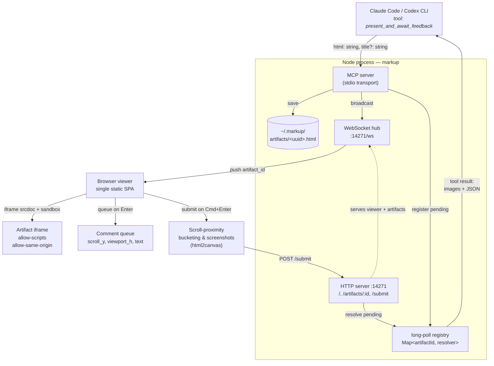
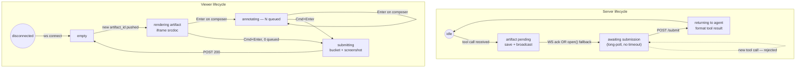

# markup v0 — Implementation Spec

> A universal annotation overlay for any HTML an agent renders.
> One MCP tool call: the agent sends HTML, you scroll and comment in your browser,
> feedback returns automatically as image + text. No copy-paste.

| Metric | Value |
|---|---|
| MCP tools shipped | 1 (`present_and_await_feedback`) |
| User context switches | 0 (no copy & paste) |
| Long-poll timeout | ∞ (indefinite) |
| Concurrent artifacts | 1 (v0 cap) |

## 01 — The Problem

| Without the portal — today | With the portal — v0 |
|---|---|
| 1. Agent generates HTML, saves to a file. <br>2. User opens in browser **manually**. <br>3. Agent must bake in "Copy as prompt" widgets per artifact. <br>4. User fiddles, clicks button, **switches windows**, pastes, sends. <br>5. Static artifacts have no feedback affordance. | 1. Agent calls MCP tool, viewer pops up automatically. <br>2. User scrolls normally — **no learning curve**. <br>3. Composer captures comments + viewport at `Enter`. <br>4. `Cmd+Enter` packages scroll-anchored screenshots + comments — **no copy-paste**. <br>5. Works on **any HTML**. |

## 02 — Architecture Flow



> [!NOTE]
> The MCP tool call is the load-bearing abstraction. Forward direction, reverse direction, blocking semantics — one Promise that resolves when the user is done.

## 03 — State Machine



## 04 — Scroll-Proximity Bucketing

Comments cluster by where they were typed, *not when*. Each comment captures the viewport range at the moment of `Enter`. On submit, overlapping ranges merge into a single bucket and one screenshot per bucket is sent back.

**Merge Condition:** `overlap(rangeA, rangeB) > 0.30`
**Cap:** `MAX_BUCKET_HEIGHT = 2500 px` (Crop centered on comment centroid when exceeded)

## 05 — Where It Sits in the Stack

| Axis | Raw "make HTML" prompt | Playground skill | markup v0 |
|---|---|---|---|
| **Layer of stack** | None — ad hoc | Generation | Hosting + protocol |
| **Where feedback widgets live** | Sometimes | Inside every artifact | Universal overlay |
| **Routes feedback to agent** | Manual paste | Manual paste | Via MCP tool result |
| **Works on static artifacts** | Yes | Awkward fit | Yes — native |
| **Works on interactive HTML** | Yes | Yes — native | Yes — sandbox |

## 06 — State Variables

| Location | Name | Description | Type |
|---|---|---|---|
| server | `pendingFeedback` | Long-poll registry | `Map<artifactId, { resolve, reject, createdAt }>` |
| server | `currentArtifact` | Pointer to active artifact | `{ id, title, htmlPath, createdAt }` |
| server | `viewers` | Set of WS clients | `Set<WebSocket>` |
| viewer | `commentQueue` | Ordered pending comments | `Array<{ id, text, scrollY, viewportH, timestamp }>` |
| viewer | `artifactState` | Top-level viewer state | `'disconnected' \| 'empty' \| 'rendering' \| 'annotating' \| 'submitting'` |
| viewer | `scrollAnchor` | Known iframe scroll position | `number` |

## 07 — Key Code Snippets

### 1. MCP Tool (`src/server/mcp.ts`)
```typescript
server.tool(
  'present_and_await_feedback',
  '...',
  { html: z.string(), title: z.string().optional() },
  async ({ html, title }) => {
    const artifact = await saveArtifact(html, title);
    broadcastNewArtifact(artifact);
    const feedback = await awaitSubmission(artifact.id);
    return { content: formatToolResult(feedback) };
  }
);
```

### 2. Long-poll (`src/server/longPoll.ts`)
```typescript
const pending: Map<string, { resolve: (f: Feedback) => void }> = new Map();

export function awaitSubmission(artifactId: string): Promise<Feedback> {
  if (pending.size > 0) throw new Error('PORTAL_BUSY');
  return new Promise((resolve) => pending.set(artifactId, { resolve }));
}
```

### 3. Composer (`src/viewer/composer.ts`)
```typescript
composer.addEventListener('keydown', (e: KeyboardEvent) => {
  if (e.key !== 'Enter') return;
  e.preventDefault();
  
  if (e.metaKey || e.ctrlKey) return submitBundle(commentQueue);
  
  const text = composer.value.trim();
  if (!text) return;
  
  commentQueue.push({ id: crypto.randomUUID(), text, scrollY: scrollAnchor, viewportH: iframe.innerHeight, timestamp: Date.now() });
  composer.value = '';
});
```

### 4. Bucketing (`src/viewer/bucketing.ts`)
```typescript
export function clusterByProximity(comments: Comment[]): Bucket[] {
  // sort by time, merge if overlap > 30%
}
```

### 5. Capture (`src/viewer/capture.ts`)
```typescript
export async function captureBucket(bucket: Bucket, iframe: HTMLIFrameElement): Promise<string> {
  const canvas = await html2canvas(doc.body, { y: start, height, windowHeight: height, useCORS: true });
  return canvas.toDataURL('image/png');
}
```

## 08 — MCP & HTTP Surface

| Endpoint | Kind | Inputs | Output |
|---|---|---|---|
| `present_and_await_feedback` | MCP tool | `html, title?` | Blocks until submit |
| `GET /` | HTTP | — | Serves viewer SPA |
| `GET /artifacts/:id` | HTTP | UUID | Returns HTML |
| `POST /submit` | HTTP | JSON bucket array | Resolves pending Promise |
| `WS /ws` | WebSocket | — | Pushes `{ type: 'artifact' }` |

## 09 — Edge Cases

| Scenario | Expected Behavior |
|---|---|
| No viewer connected | Try `open()` to viewer URL. Block, viewer can attach late. |
| Browser closed mid-session | Next tool call re-broadcasts. Server doesn't crash. |
| Concurrent tool calls | Reject second call with `PORTAL_BUSY`. |
| html2canvas fails | Fallback to server-side Puppeteer (v0.2 planned). |

## 10 — Test Requirements

| Layer | What | File |
|---|---|---|
| unit | Overlapping viewports merge | `bucketing.test.ts` |
| unit | Tool result shape matches spec | `formatResult.test.ts` |
| integration | Tool call → WS → POST /submit loop | `loop.test.ts` |

## 11 — Project Layout

```
markup/
├── package.json
├── .mcp.json
├── README.md
├── src/
│   ├── index.ts
│   ├── server/       (mcp, http, ws, longPoll, artifacts)
│   ├── viewer/       (index.html, main, composer, bucketing, capture)
│   └── shared/       (types)
└── tests/
```

## 12 — Implementation Notes

> [!CAUTION]
> **Critical — iframe sandbox is load-bearing**
> The iframe must be `sandbox="allow-scripts allow-same-origin"`. Without scripts, interactive HTML breaks. Without same-origin, html2canvas fails.

> [!WARNING]
> **Warning — html2canvas is best-effort**
> Modern CSS filters and cross-origin images can degrade screenshots.

> [!TIP]
> **Success criterion — the dogfood test**
> v0 is done when this spec can be viewed and annotated in the tool itself, returning image blocks to the agent automatically.
